# SpringBoot-EveryTime

안녕하세요. 진경빈입니다.  
에브리타임 홈페이지를 Spring-Boot를 이용하여 제작했습니다.
팀 프로젝트로 진행이 되었습니다.

인원은 2명으로 각자 파트를 맡아서 진행되었습니다

진경빈 파트 : 로그인, 회원가입, 게시판입니다.
김현직 파트: 회원정보 수정, Oauth로그인, 시간표 입니다.

프로젝트 기간 : 2021-03-11일 ~ 2021~04-07일

# 목차
- 홈페이지 시연 영상
- 기능
- 사용 기술
	- Front end
	- Back end
	- 배포
	- 도식화
 - 개발 환경 
    - 기존 의존성
    - 추가 의존성
    - Mysql
 - 화면 설명
 - DB 초기 데이터
 -  블로그 주소
  
# 진경빈 - 구현 영상 (그림을 클릭하세요)

# 김현직 - 구현 영상 (준비중..)

# 진경빈 구현한 기능 
- 회원가입
- 로그인
- 게시판 
  - 글 쓰기
  - 글 수정
  - 글 삭제
  - 글 제목 검색 
  - 글 페이징
- 댓글 
  - 댓글 쓰기
  - 댓글 삭제
  - 대댓글 쓰기
  - 대댓글 삭제
- 실시간 인기글 TOP3
- 전체 게시판 리스트 출력
- AOP Vaildation 체크
- Batch Exception 처리

# 김현직 구현한 기능 
- OAuth2 -Facebook 로그인
- 비밀번호 수정
- 이메일 수정
- 학교 수정
- 시간표 조회
- 시간표 목록별 이동
- 시간표에 수업 추가

# 사용 기술
 
## Front end

  - JSP - [EveryTime 홈페이지 카피]
  - CSS- [EveryTime 홈페이지 카피]
  - JQuery
  - Bootstarp
  - Javascript
  
  ## Back end

  - MVC
     - Contrlloer
     - Service
     - Model
     - Repository
         - DB-MySQL
     - JPA
         - @Query
         - NamingQuery
         - Join
         - Pageable
     - DTO
  - AJAX
  - AOP
      - Valid
  - Batch
     - Exceipton

## 배포
- 네이버 클라우드
- Micro
- ubuntu
- Putty
- Docker
- tomcat
- Mysql

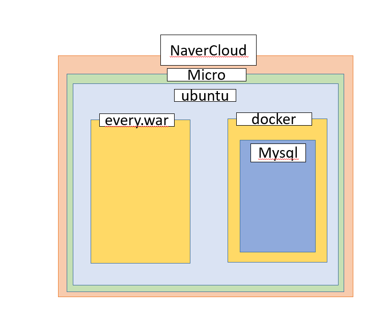

 
 
  
## 도식화
 ###  MVC 패턴
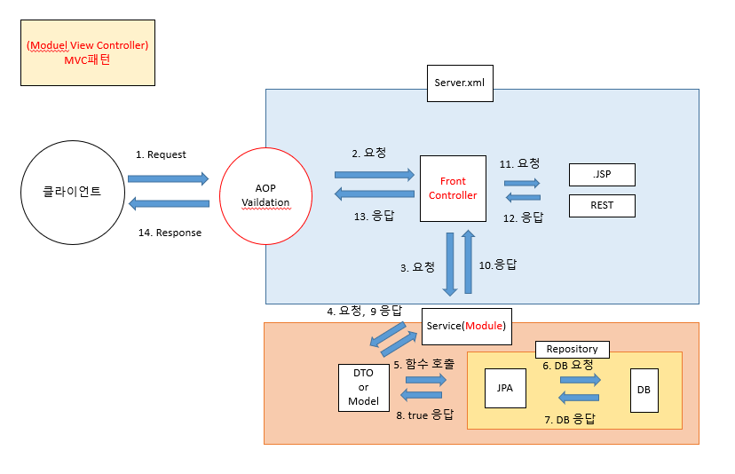

## 개발환경
- 개발언어 : JAVA SpringBoot - 2.4.3V
- IDE : STS, Vscode
- DB : Mysql 8.0
- WAS :  tomcat
- 배포 : 네이버 클라우드- Docker

##  의존성

  - 기본 의존성
      - Spring Boot DevTools
      - Lombok
      - Spring Data JPA
      - MySQL Driver
      - Spring Security
      - OAuth2 Client
      - Spring Web
      - Validation

  - 추가 의존성
      - AOP
      - JSTL
      - security (JSP에서 사용하는것)
      - JSP 템플릿 엔진

# Mysql

## 게시판 모델링 

 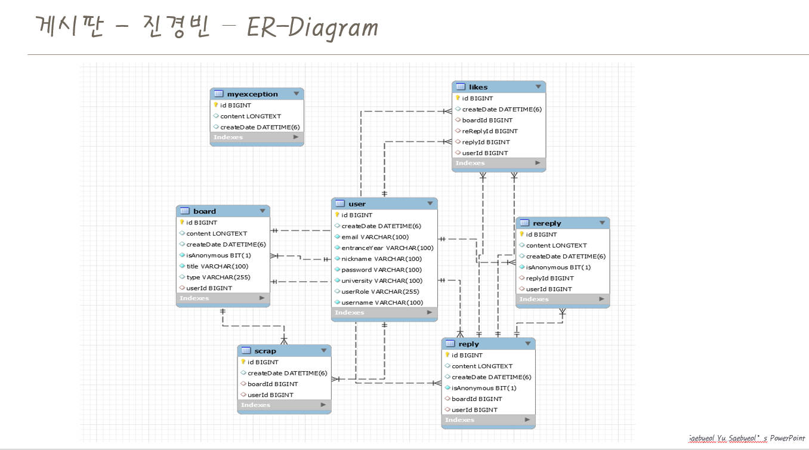

 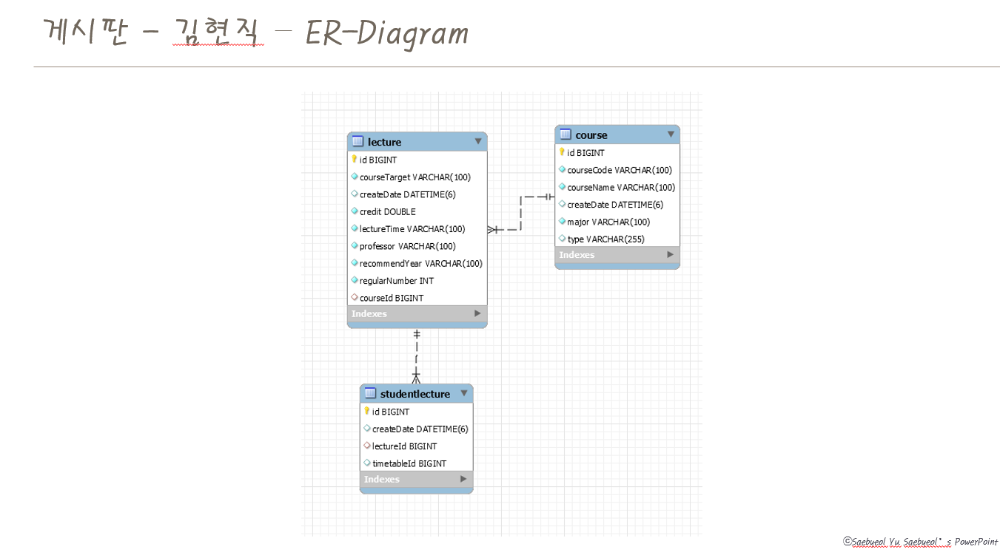

## 시간표 모델링

## 페이지 화면 소개 

###  1. 로그인 회원가입
 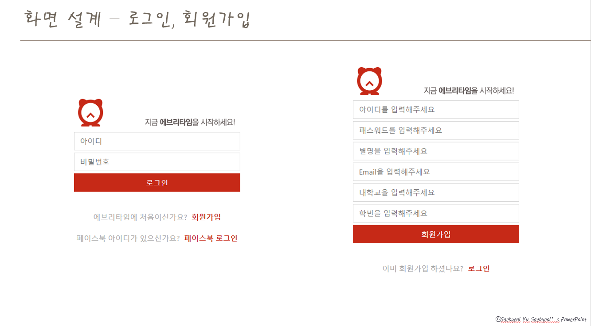

  
   
  
### 2. OAuth2로그인, 추가회원정보
 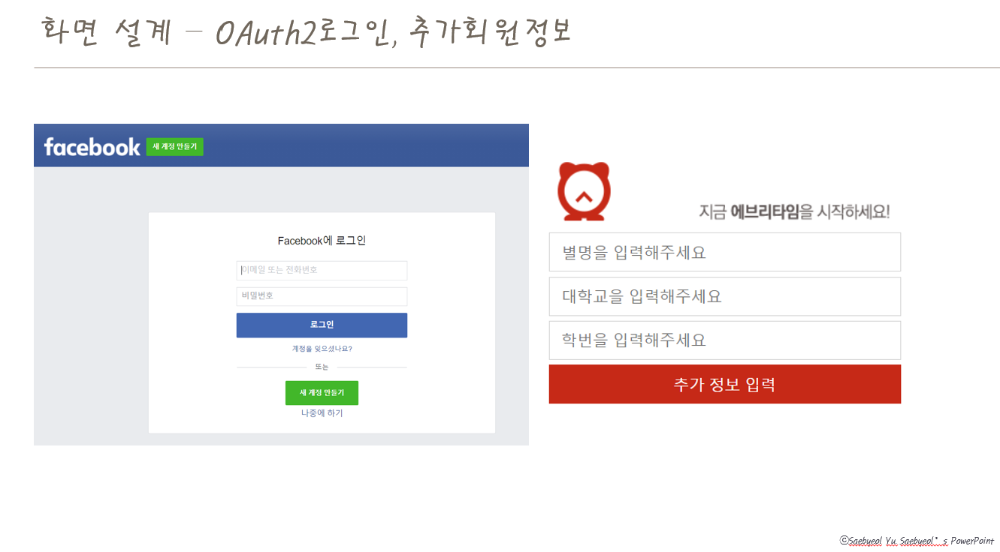

  
   
  
### 3. 서브메뉴 페이지
 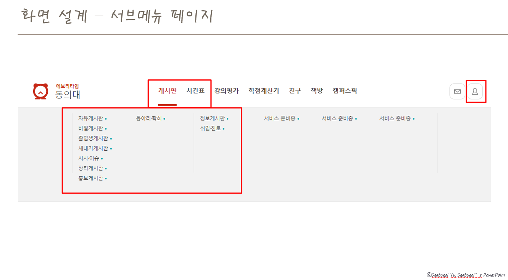

 
 

### 4. 메인메뉴 페이지
  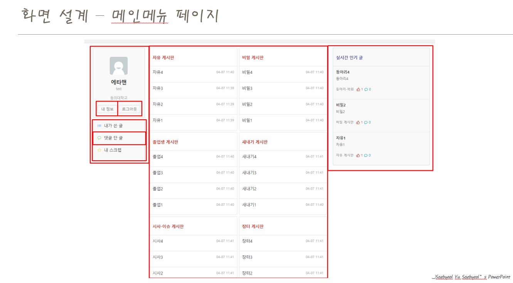

 
 

### 5. 내정보, 학교 인증페이지
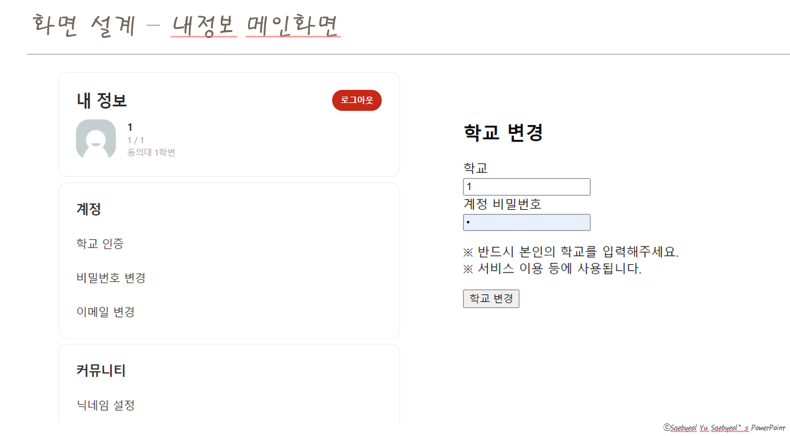

 
 

### 6. 비밀번호 변경, 이메일 변경
   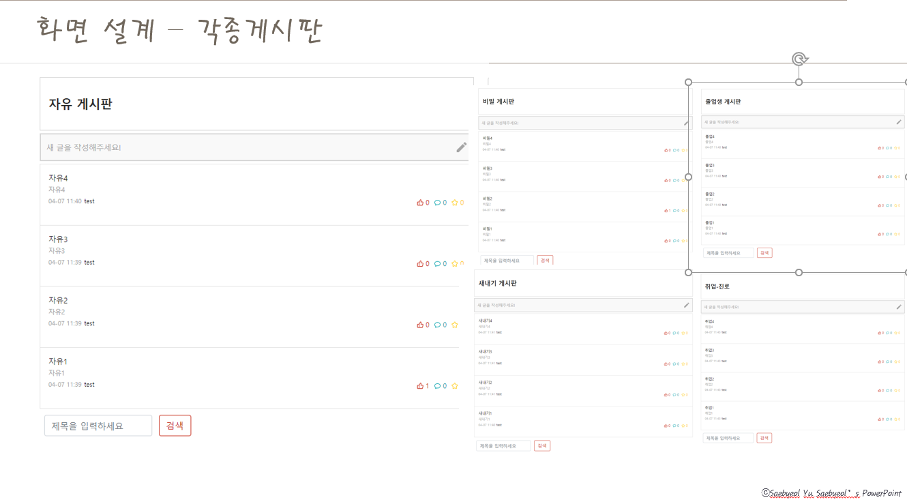

### 7. 각종 게시판

 
 
 
### 8. 글쓰기, 익명여부
 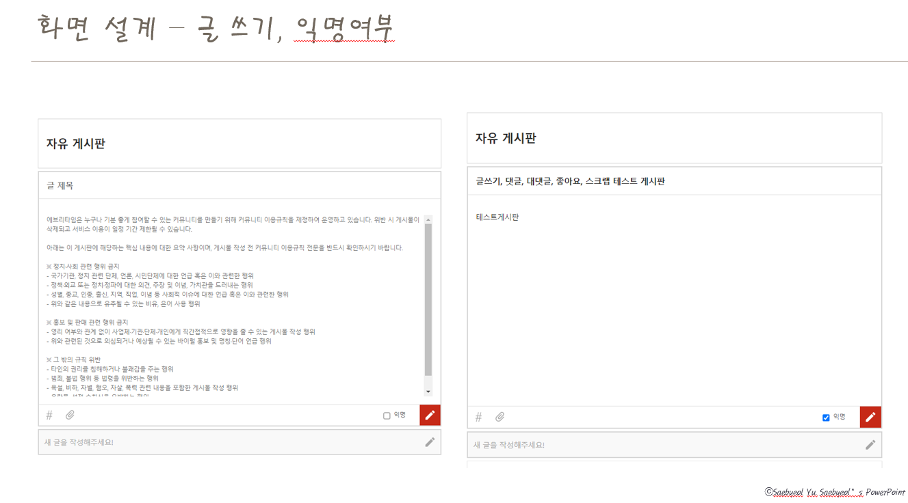
 
 
 

### 9. 내 스크랩, 댓글 단 글, 내가 쓴 글
 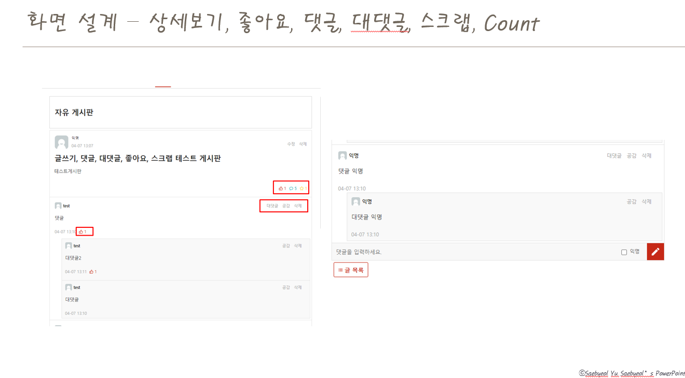
 
 
 

### 10. 실시간 인기 Top3
 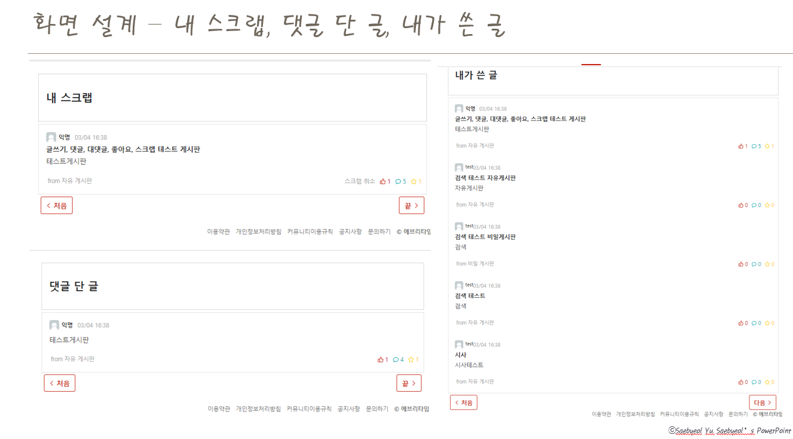 

### 11. 시간표 조회

### 12. 시간표에 수업 추가

### 블로그 주소
### 진경빈 블로그 주소 : https://blog.naver.com/skjin20800
### 진경빈 Notion 주소 : https://www.notion.so/EveryTime-b1785a5532c841bebd5b1655b30c6333
